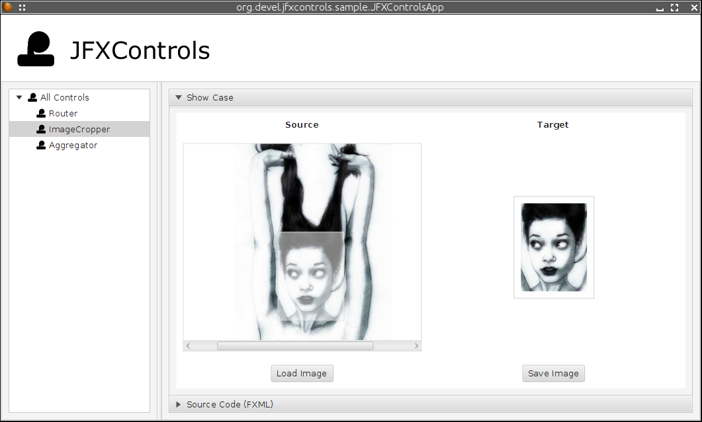

JFXControls
===========

##Common Tasks

###System Prerequisites
* Java 8
* Gradle
* Git
* some IDE - I'm still using eclipse..
* further tools of your like

###Behind a Proxy?
If you're behind a proxy server: There is an <pre>application.conf</pre> provided under the following path:

<pre><code>
JFXControls/src/main/resources/org/devel/jfxcontrols/conf/application.conf
</code></pre>

Please customize this depending on your needs.

###Eclipsify the Project

<pre><code>
.. $ gradle eclipse
</code></pre>

No you're ready 4 import! Remembers me on SBT a bit :D

###Testing
And once again pretty simple:

<pre><code>
.. $ gradle test
</code></pre>

###Build a native client
Just run the following commands havin' a gradle distribution on your env path.

<pre><code>
.. $ gradle install
.. $ gradle assemble
</code></pre>

After running the <pre>SUCCESSFULL BUILD</pre> you'll find the following bundles inside the freshly created <pre>build</pre> directory:

* executable JAR
* native client 4 windows and linux os
* all required classpath libs to run the sample application

##Show Case Controls

###Router (JFXMaps)
[TODO: Doc | Refactor]

###ImageCropper
[TODO: Doc | Refactor]

###MasterDetailsView
[TODO: Impl]

###TreeTableView
[TODO: Impl]
